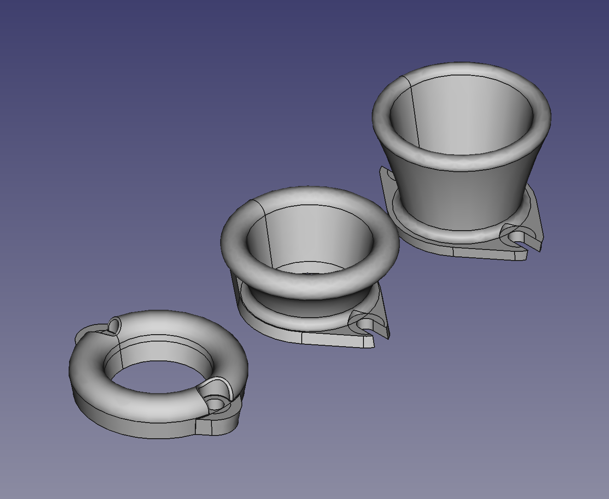

# 4AGE-Intake-Parts

Velocity stacks and adapter plates for 4AGE ITB engines.

## Silvertop

`Silvertop-ITB-PX500-Plate.dxf` Is a silver-top ITB plate for fitting a pipercross PX500 filter (this is the small one). Running a PX500 means you can squeeze in the ITBs in engine bays where clearance between the stock brake booster and air filter is a problem. EG, these fit in a KP60 with a 4AGE using the stock brake booster that has been mildly clearanced.

`4age-silvertop.FCStd` Is a FreeCAD file containing velocity stacks 20mm, 40mm and 60mm velocity stacks for silver-top ITBs. Note: if you're running a PX500, the 20mm bellmouths wont clear the air-filter if used on cylinders 1 and 4.

